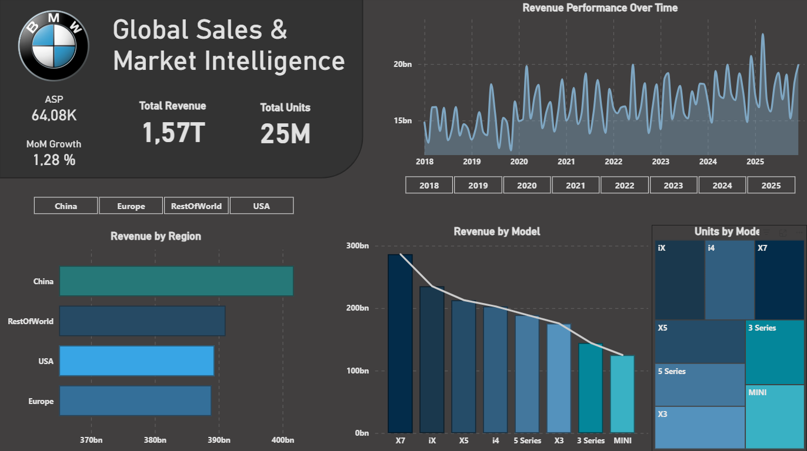
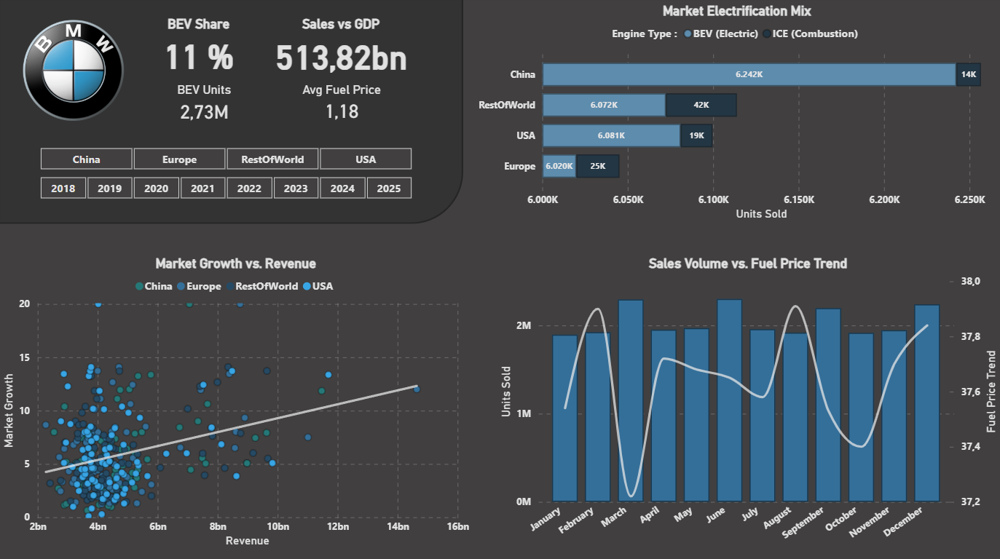

# BMW Global Sales & Market Intelligence Analysis

## 📌 Resumen del Proyecto
Este proyecto presenta un análisis del rendimiento de ventas globales de BMW (2018-2025). 
Se centra en la integración de **SQL** para el procesamiento de datos y **Power BI** para la visualización de resultados.

* El dataset fue obtenido de *https://www.kaggle.com/datasets/dmahajanbe23/bmw-global-automotive-sales*

### 📊 Dashboard Preview

## 🛠️ Tecnologias
* **Data Engineering (SQL):** Procesamiento de datos (EDA), limpieza profunda (ETL) y diseño de un modelo relacional en estrella (Star Schema).
* **Business Intelligence (Power BI):** Modelado de datos relacional, diseño de reportes interactivos y desarrollo de métricas y medidas mediante DAX.

## 📂 Estructura
El proceso técnico está documentado paso a paso dentro de los archivos SQL, donde se detalla cada etapa del análisis:

1. **`00_bmw_sales.csv`**: Dataset fuente con los datos originales de la marca.
2. **`01_bmw_eda.sql`**: **Análisis Exploratorio (EDA)**. Contiene la validación de integridad, detección de duplicados, manejo de nulos y limpieza inicial.
3. **`02_bmw_etl_modeling.sql`**: **ETL y Modelado**. Documentación del proceso de transformación y creación de tablas de hechos y dimensiones para optimizar el análisis.
4. **`03_bmw_analysis_queries.sql`**: **Consultas de Análisis**. Scripts diseñados para extraer insights específicos de negocio directamente desde la base de datos.
5. **`04_bmw_dashboard.pbix`**: Dashboard interactivo donde se visualizan los hallazgos finales.
6. **`bmw_night_theme.json`**: Configuración de la paleta de colores personalizada del reporte.

## 📖 Glosario de Datos (Data Dictionary)
Para facilitar la interpretación de los scripts de SQL y el Dashboard, se detallan las variables del dataset original y las métricas calculadas:

* **Year / Month:** Periodo temporal del análisis (2018-2025).
* **Region:** Mercados geográficos clave (Europe, China, USA, RestOfWorld).
* **Model:** Variantes de modelos BMW analizados.
* **Units_Sold:** Volumen de unidades entregadas por región, mes y modelo.
* **ASP (Average Price EUR):** Precio promedio de transacción estimado por vehículo en Euros.
* **Revenue_EUR:** Ingresos totales estimados (Units_Sold × Avg_Price_EUR).
* **BEV_Share (Battery Electric Vehicle):** Porcentaje de penetración de vehículos eléctricos de batería (0-1).
* **Premium_Share:** Participación estimada de BMW dentro del segmento automotriz premium de cada región.
* **GDP_Growth:** Tasa de crecimiento del PIB regional (%).
* **Fuel_Price_Index:** Índice de costo relativo del combustible por mercado.
